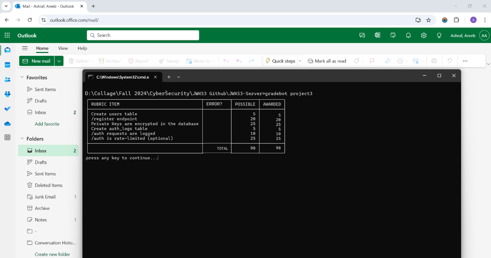

**Areeb Ashraf - aa2672**
**Project 3 jwks**

- To start the server `node server.js`

- Check the JWKS Endpoint
`curl http://localhost:8080/.well-known/jwks.json`

- User Registration Endpoint: Register a new user (username and email are required, password will be generated and returned):
`curl -X POST -H "Content-Type: application/json" \`
`-d '{"username": "newuser", "email": "newuser@example.com"}' \`
`http://localhost:8080/register`

- Authentication Endpoint: Authenticate an existing user:
`curl -X POST -H "Content-Type: application/json" \`
`-d '{"username": "newuser", "password": "password-from-registration"}' \`
`http://localhost:8080/auth`

- Rate Limiting for Authentication:
    - The POST:/auth endpoint enforces a rate limit of 10 requests per second per IP.
    - Exceeding the limit will result in an HTTP 429 Too Many Requests response.

- Generate Valid JWT:
`curl -X POST http://localhost:8080/auth`

- Generate an expired JWT:
`curl -X POST http://localhost:8080/auth?expired=true`

**Gradebot Screenshot**
